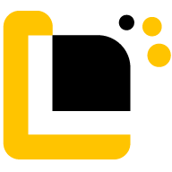

<div align="center">
  
  <br />
  <br />
  
  
  
  
  <br />
  <br />
  <h1>🤝 CollaboLab</h1>
  <p><b>Temukan Partner. Build Future.</b></p>
  <p><i>Platform kolaborasi digital bergaya Neobrutalism yang mempertemukan pelajar berdasarkan kecocokan skill, minat, dan kebutuhan proyek — bebas ghosting, bebas spam.</i></p>
  <br />
</div>

---

## 🎯 Tentang Proyek Ini

CollaboLab dikembangkan oleh **Team Galatea (SMKN 69 Jakarta)** untuk mengikuti **System Innovation Idea Challenge (SIIC)** — salah satu cabang lomba **GENETIC (Generasi Teknologi Informasi Competition)** dalam rangkaian **DIGIFEST 2026 (Digital Innovation Grand Festival)** yang diselenggarakan oleh HIMMATISI dan Developer Community (DECOMUS) Universitas Semarang.

Mengusung tema **"SYNERGY: System, Youth, and Next-Generation Technology"** dengan subtema **"Smart Society & Digital Solutions"**, peserta ditantang merancang ide kreatif berbasis teknologi yang memberi solusi nyata terhadap isu sosial di masyarakat — mendorong terciptanya sistem yang lebih cerdas, efisien, dan terintegrasi.

CollaboLab hadir menjawab tantangan tersebut: bukan lagi soal kekurangan ide, melainkan kesulitan generasi muda menemukan orang yang tepat untuk mewujudkan ide tersebut.

---

## 💡 Problem & Solusi

Pelajar dan generasi muda memiliki banyak ide brilian, namun sering terhambat oleh:
1. **Susah cari rekan kolaborasi** yang sesuai skill, minat, dan kebutuhan proyek — pembentukan tim masih bergantung pada lingkaran pertemanan.
2. **Krisis kepercayaan**: ghosting, anggota tim pasif, dan minimnya akuntabilitas dalam kolaborasi daring.
3. **Anxiety & introvert**: ragu memulai perkenalan dengan orang baru secara online.
4. **Tools yang tercerai-berai**: harus berpindah-pindah aplikasi (chat, manajemen tugas, pencarian partner) sehingga informasi mudah hilang.

**Solusi CollaboLab:**
Platform kolaborasi digital terintegrasi yang menggabungkan pencarian partner berbasis kecocokan skill, ruang kerja real-time, sistem reputasi, dan dukungan AI dalam satu ekosistem — mewujudkan sinergi antara sistem, generasi muda, dan teknologi masa depan.

---

## ✨ Fitur Unggulan

### 🤝 1. Smart Skill Match
Sistem pencocokan anggota tim yang menganalisis kesesuaian keterampilan, minat, pengalaman, dan kebutuhan proyek untuk merekomendasikan kolaborator paling relevan.

### 🏠 2. Collab Hub
Ruang kerja digital real-time yang menggabungkan **Live Chat**, **Kanban Board**, dan **Quick Polling** dalam satu platform untuk komunikasi, pembagian tugas, dan pemantauan progres proyek (*powered by Pusher*).

### 🛡️ 3. Trust Score System
Sistem reputasi yang menilai kredibilitas dan komitmen pengguna dalam berkolaborasi. Skor meningkat dari kontribusi positif dan menurun jika pengguna pasif atau meninggalkan proyek tanpa penyelesaian jelas.

### 🤖 4. AI Hub
Pusat layanan berbasis kecerdasan buatan (Gemini AI) yang membantu menyusun *project brief*, menganalisis kebutuhan skill tim, memberi rekomendasi proyek, dan merangkum evaluasi proyek secara otomatis.

### 🕵️ 5. Anonymous Introduction Mode
Fitur perkenalan dengan identitas sementara bagi pengguna yang masih ragu memulai interaksi, sebelum membuka identitas asli setelah merasa nyaman dengan tim.

### 📡 6. Social Discovery Feed
Feed untuk membagikan progres proyek, info kompetisi, dan peluang kolaborasi guna memperluas jaringan dan membangun komunitas yang aktif.

---

## 👥 Target Pengguna

- **Pelajar** — aktif kompetisi, riset, atau punya ide tapi sulit menemukan tim yang pas.
- **Mahasiswa** — butuh anggota tim untuk kegiatan akademik/non-akademik (riset, lomba, organisasi, produk digital).
- **Inovator Muda** — punya gagasan yang ingin dikembangkan bersama tim dengan kompetensi beragam.

---

## 🎨 Design System: Neobrutalism

CollaboLab mengadopsi gaya **Neobrutalism** yang mencerminkan energi Gen-Z: *Bold, Berani, dan Anti-Mainstream*.
- **Ciri Khas:** Border hitam tebal (3px), bayangan offset solid (`4px 4px 0px #000`), dan warna neon kontras (Kuning `#FFE500`, Mint `#00D37F`).
- **Typography:** Space Grotesk (Heading) & Inter (Body).

---

## 🛠️ Tech Stack

**Frontend:**
- [Next.js 16](https://nextjs.org/)
- [React 19](https://react.dev/)
- [Tailwind CSS](https://tailwindcss.com/)
- [dnd-kit](https://dndkit.com/) (Drag & Drop Kanban)

**Backend & Database:**
- Next.js API Routes (Serverless)
- [Prisma ORM](https://www.prisma.io/)
- [NeonDB](https://neon.tech/) (PostgreSQL Serverless)

**Real-time, Auth & AI:**
- [Pusher Channels](https://pusher.com/) (WebSockets)
- [NextAuth.js](https://next-auth.js.org/) (Google OAuth & Credentials)
- [Gemini AI](https://ai.google.dev/) (AI Recommendation Engine)

---

## 🚀 Panduan Instalasi Lokal

1. **Clone repository ini:**
```bash
   git clone https://github.com/WahyuAndikaRahadi/Collabolab.git
   cd collabolab
```

2. **Install dependensi:**
```bash
   npm install
```

3. **Siapkan Environment Variables:**
   Duplikat file `.env.example` menjadi `.env` lalu isi *credentials* database Neon, Auth, Pusher, dan Gemini AI.
```bash
   cp .env.example .env
```

4. **Sinkronisasi Database:**
```bash
   npx prisma db push
```

5. **Jalankan Development Server:**
```bash
   npm run dev
```
   Akses `http://localhost:3000` di browser.

---

## 🔗 Tautan Penting

- 🌐 **Live Demo:** [collabolab.vercel.app](https://collabolab.vercel.app/)

---

## 🏆 Kompetisi

Proyek ini diikutsertakan dalam:

**System Innovation Idea Challenge (SIIC)**
GENETIC 2026 — DIGIFEST 2026, Universitas Semarang
Subtema: *Smart Society & Digital Solutions*
Tema Besar: *"SYNERGY: System, Youth, and Next-Generation Technology"*

---

<div align="center">
  <p>Dibuat dengan 💻 dan ☕ oleh <b>Team Galatea</b> (SMKN 69 Jakarta) untuk DIGIFEST 2026</p>
  <p><sub>Bagus Hasam Ali · Wahyu Andika Rahadi · Irham Thoriqsah Secaatmaja</sub></p>
</div>
